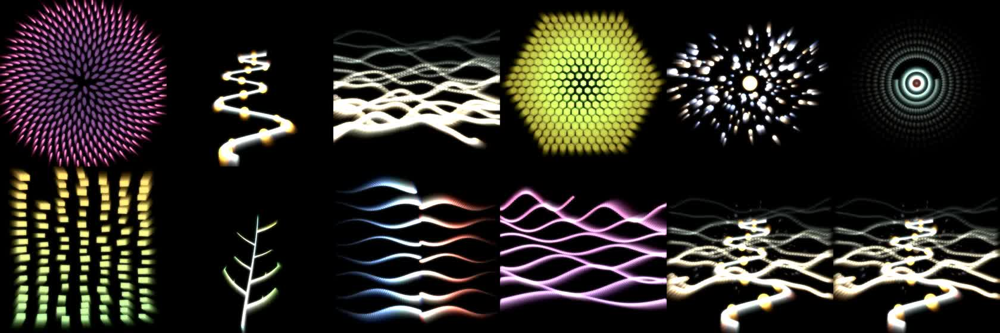

# Speechform

Speechform listens while you talk. It hears what kind of speech you are making, and it grows an image of that speech as you go. A story lays down a winding path with lanterns, and a poem opens a flower. Scenery raises ridgelines, and a reflection grows one still kelp whose branches are your ideas. Everything grows from what you say, and none of it is text.

Below the image, you can watch the decision being made: the words that pushed it, where the talk lands among nineteen kinds of speech, the scores, the choice and its reason, and who is steering the image. Everything you say is kept in a memory on your own Mac.



A one-minute recording is in [docs/demo.mp4](docs/demo.mp4).

## What you see

- **The image (top).** TouchDesigner draws it in a 720 by 720 square, sized for the top half of a phone. Each kind of speech has its own image, and each grows with the words spoken in it. Images never overlap. The kind you are speaking now takes the square, and the images your talk grew earlier stand in a row of small tiles beneath it, in the order they appeared.
- **Transcript.** Each phrase you say or type appears with the kind of speech it was heard as and the image it grows. A phrase that returns to an earlier idea is marked with ↺.
- **Classifier.** Each phrase travels a pipeline: listen, words, embed, compare, choose, idea, direct, grow. Each stage lights as the phrase passes through it. The screen also shows the following:
  - **Word heat** lights each word by how much it pulled the phrase toward its kind.
  - **The map** lays out the nineteen kinds of speech. The talk lands among them, with lines drawn to its nearest kinds and a trail of the talk so far.
  - **The scores** are nineteen bars that re-sort as each phrase is weighed, with the winning margin marked.
  - **The choice** is stated with its reason, such as "a clear margin of 0.21" or "held until it is heard again".
  - **The idea** shows whether the phrase starts a new idea or returns to one, measured against a threshold.
  - **The direction** shows who is steering the image and every value they set, with a log of each decision and its reasons.
- **Five more views of the classifier**, chosen by the icons above it (`light/views.js`, shared by the full app and Light):
  - **River** shows every kind's share of the points after each phrase as a stream, with the chosen kind in a strip beneath and each switch named. The choice can lag the stream, because a new kind must lead clearly or lead twice.
  - **Window** shows the minute of talk a phrase was heard with, and the share of the verdict each earlier phrase earned as its words recede.
  - **Build** shows how the five leading kinds' points were built. In the full app that is the nearest examples, less the kind's general pull, plus the shape of the passage. In Light it is each marker word and each shape.
  - **Shape** is a radar of how the phrase is built (commands, questions, "I", past tense, run-ons, refrains and more), with the phrases before it fading behind.
  - **Ideas** shows every idea as a hexagon sized by its words, with every phrase tied to its idea and the returns drawn in amber.
- **Memory.** Everything you have said in Speechform, across every session, grouped by day and searchable. Tap a phrase to watch it being classified again.

| Kind of speech | Image | What grows |
| --- | --- | --- |
| Poetry | bloom | Petals open in a golden-angle spiral around stamens. Each new idea opens a smaller flower in a ring around it. |
| Story, reading aloud, character | path | A winding trail with lanterns and footprints climbs toward the horizon. Each new idea forks a path off it, and each return lights a lantern on that path. |
| Scenery | land | Ridgelines rise one behind another, a river winds down from the horizon, and stars come out above. |
| Lore, myth | hive | Hexagons are laid ring by ring. Each idea buds a comb of its own, and the comb in play glows with honey. |
| Cosmology | orrery | Bodies join a sun on widening orbits. Each idea is a planet with a moon for every return. |
| Mystery, argument | rings | Rings close in on a point, and the centre blinks at "the point of all of this is". Each idea ripples from a centre of its own, and the ripples cross. |
| Instruction, lecture, lesson | stack | Stones build into a cairn of towers, with arched bridges laid between them at every level both reach. |
| Reflection, stream of consciousness, thinking aloud | kelp | One still stalk grows a branch for each idea. Every return forks the branch, every phrase adds a bud, and bubbles rise. |
| Dialogue | tide | Two tides meet where the speakers' share of the talk balances, and foam gathers at the line. |
| Song, lyrics | waves | Ribbons swell with the voice. Each idea adds a ribbon with a rhythm of its own. |

## What you need

- **A Mac with macOS 26 or later.** Live transcription uses Apple's on-device SpeechAnalyzer, so no audio leaves your Mac. On an older macOS you can still type phrases.
- **[TouchDesigner](https://derivative.ca/download)**, which draws the image and listens to the microphone. The free Non-Commercial licence is enough. A `.toe` file needs TouchDesigner or TouchPlayer to run. Without TouchDesigner, the transcript, the classifier and the memory still work for typed phrases, and the image screen stays dark.
- **Python 3.11 or later.**

TouchDesigner opens as one small window showing only the image, in perform mode, at thirty frames a second. Press Esc in that window to see the network. `td_runtime.configure()` applies these settings at every start. It also switches off the first pass's own visuals, which Speechform does not use. Together these took TouchDesigner from about 80% of one core to about 37% on an M-series Mac.

## Install

```sh
git clone https://github.com/storymapradio/speechform.git
cd speechform
./setup.sh
```

`setup.sh` does the following:

- makes the worker's Python environment in `.worker`;
- installs `sentence-transformers` and downloads the small MiniLM model (about 90 MB);
- builds Apple's transcription helper;
- builds `mac/Speechform.app`.

Then open **mac/Speechform.app**. You can move it anywhere; the first time, it asks where the Speechform folder is and remembers the answer.

The same page runs in any browser. Start the server with `.worker/bin/python imagery/server.py`, then visit **http://127.0.0.1:9990**.

## Using it

A row of icons runs across the top.

| Icon | Does |
| --- | --- |
| ≡ | Opens the transcript. |
| ⋄ (four joined points) | Opens the classifier. |
| ◷ | Opens the memory. |
| ▶ | Starts. It opens TouchDesigner if it is not running, then listens. The green dot means TouchDesigner is drawing. |
| ■ | Stops listening. The image holds where it is, and closing the app stops listening too. |
| + | Starts a new session. Memory keeps everything already said. |
| ⚿ (a key) | Holds the provider fields: provider, endpoint, key, model, and how often to ask. **Test** asks the provider once. |

You can also type a phrase below the transcript.

The key fields are optional. With no provider, a built-in stand-in steers the image by simple rules: warmth from warm and cool words, tempo from the pace of speech, trail memory from how often ideas return, and a variation for each idea. You can add one of the following:

- **Jev**, or any decision service. Give its endpoint and key; every few seconds it receives the latest transcript and answers with decisions (see [AGENTS.md](AGENTS.md)).
- **Claude**, with your Anthropic API key. The default model is Claude Haiku 4.5.
- **A local model** through any OpenAI-compatible endpoint, such as [Ollama](https://ollama.com) at `http://127.0.0.1:11434/v1` with `gemma3:1b`.

## Reading a long talk

Speechform is made for long talks and discussions, so it looks at the longer arc.

- **The kind of speech is judged over time.** Each phrase is heard with the two minutes (up to 120 words) before it, and its shares join a running share for every kind, so one phrase moves it only so far.
- **The speaker gets the benefit of the doubt.** The longer a kind has held, the more a new kind must lead by, or the more phrases in a row it must lead. A two-phrase aside in a long instruction stays instruction; a story told for about a minute takes over.
- **The doubt is shown.** The bars view and the river's amber line show how near the classifier is to changing its mind.
- **Images change slowly.** An image takes about half an hour of speech to fill, the image in front holds the square for at least half a minute, and changes glide over a few seconds.

## Jev reads at the end, and teaches the classifier

Jev (TypeSafe) is never asked while you speak. When a recording stops, Jev reads it once, in one call: the kind of the whole recording, its style, whether it is safe to draw, and the kind of each of up to twelve passages. Every passage Jev is at least 60% sure of is kept in `runtime/learned.json` (the newest forty per kind) and teaches the classifier:

- the full engine takes each passage as a new example of its kind, beside the written examples, and the build view shows what it adds in blue;
- Light takes the words that set each kind's passages apart and gives them points for that kind.

So each recording makes the next one read closer to how Jev hears it.

**Claude refines the rules, so that one day Jev is not needed.** After Jev reads a recording, the passages where the classifier and Jev disagreed go to Claude (the Claude Code command line, headless, on this Mac, `imagery/refine.py`). Claude answers with marker rules only: a pattern that captures how something is said, the kind it points to, and a weight. Each rule is tried on its own and kept only if it raises either classifier's agreement with Jev and neither classifier loses a single fixed test passage. Kept rules are in `runtime/rules.json` and are read by both classifiers; every attempt, kept or not, is in `runtime/refinements/`.

**When Jev is no longer needed.** Each recording Jev reads records how often the classifier agreed with it (`runtime/agreement.json`). Once the classifier agrees on at least nine passages in ten for five recordings in a row, Jev stops being asked, and reads only every fifth recording to catch any drift. The deck shows the agreement so far. `reading.txt` in each recording's folder lists every passage with what the classifier said and what Jev heard.

## Screens

Every screen is an icon in the top row: the transcript; the classifier as now, bars, river, window, build, shape and ideas; memory; and the deck. The last icon opens every graph at once, over the whole window, and they keep moving while you speak. The arrow keys and a swipe move from screen to screen.

## Cards

When a recording stops, Speechform reads it whole and turns it into a card. The ▣ icon opens the deck, and ⊕ makes a card of the whole session at any time.

**The reading** (`light/reading.js`, shared by both versions) weighs the recording at three scales:

- **Each phrase**, as the classifier heard it.
- **Each section.** Every run of one idea is a section, and a window of about fifty words also slides along the recording, half a window at a time.
- **The whole recording**, with every phrase counted by its words.

Each scale gets a share for every kind of speech and an average shape. The reading also measures how often the kind switched, how clearly each phrase was marked, how the ideas held together, and how often the talk came back to one. All of it is kept with the card.

**The card** is written from the reading:

| Part | Where it comes from |
| --- | --- |
| Name | the idea with the most words |
| Type | the image of the leading kind, then the first and second kinds |
| Level (1 to 12 hexagons) | the length of the recording and its number of ideas |
| Focus | how clearly the talk declared its kind, and how rarely it switched |
| Hold | how well the talk stayed with its ideas, and how often it came back to them |
| Rarity | how far this recording's profile sits from the average of your earlier cards: common, rare, super rare or ultra rare (a rainbow foil) |
| Colour strip | every kind's share, side by side |
| Effect | sentences written from the reading, for example "It returns to the lantern twice." |
| Back | the image the talk grew, the six largest shares, Jev's verdict and the clearest moment |

Tap a card to flip it, and use the arrow to save the side you are looking at as a PNG. Beside the card is its replay: press play and the audio plays while the transcript follows along and any of the six graphs moves through the recording as it happened. Drag the line to go anywhere, or tap a line of the transcript to go to it. The folder icon opens the recording's folder in Finder.

**The name.** A title the speaker states becomes the card's name: "this story is called…", "the title is…", "Chapter Three: The Lighthouse", "Lesson four", "The Raven, by Edgar Allan Poe", "Welcome to…". Without one, the card is named after its busiest idea.

**Where everything is kept.** Every recording has one folder in `runtime/cards/`, named by its date, time and card. To keep it on the Desktop, run `ln -s "$PWD/runtime/cards" ~/Desktop/"Speechform Cards"`. Each folder holds:

| File | What it is |
| --- | --- |
| `audio.wav` | the recording. The full app takes it from TouchDesigner's microphone pieces, laid at their own times; Light keeps its own copy while it listens |
| `transcript.txt` | every phrase, with its time, speaker, kind of speech and idea |
| `reading.txt` | the reading in words: the shares for the whole recording, each idea and every fifty words; Jev's answers; how the art was made |
| `card-front.png`, `card-back.png` | the card, both sides |
| `grown.jpg`, `painted.png` | the image the talk grew, and the easel's picture |
| `phrases.json`, `reading.json`, `card.json` | the same as data, with the classifier's full reasoning for every phrase |

Sections classified by hand are kept in the same folder under `Sections`, one text file each. Nothing in it leaves the Mac or goes to GitHub.

**The art.** Every card has two sides:

1. **The abstract side** is the image your talk grew. The full app takes TouchDesigner's last frame, and Light captures its own canvas. It is free, instant and never leaves your Mac.
2. **Jev decides**, when a TypeSafe key is saved, in the one call it makes when the recording stops: the kind of the whole recording and of each passage, which of the six styles fits it, whether it is safe to draw, and whether a picture already in the bank fits it well enough to reuse. A recording Jev judges unsafe keeps its abstract side only.
3. **The bank** is searched next. A picture of the same image and style sharing at least half its words is reused at no cost.
4. **The easel draws the clear side** (`imagery/easel.py`). It runs SDXL Turbo on the Mac's GPU in its own process on port 9996. It redraws the abstract image toward a prompt written from the recording's most repeated words, in the chosen style, keeping the shape and colour the talk made. A picture takes three to eight seconds and never leaves the Mac. The new picture also goes into the bank, where Heavy can reuse it.

Run `imagery/easel-setup.sh` once to install the easel (about 7 GB). The Speechform server starts it the first time a card needs a picture. SDXL Turbo comes from Stability AI under its own licence, which is free for personal and non-commercial use; the model is downloaded to your Mac and is not part of this repository.

**Sections.** Select any words in the transcript, and a hexagon appears beside them. Tap it, and those words are read on their own, phrase by phrase: by the MiniLM engine in the full app, and by the algorithm in Light. The classifier views then show the section, and the section is kept with its shares under ▤ in the deck. Tap a kept section to see it in the views again.

## Privacy

Speechform needs no account and connects to none. Your speech is transcribed on your Mac and classified on your Mac. Your memory is kept in `runtime/memory.jsonl` and your keys in `~/.config/speechform/settings.json`, and neither is ever part of this repository. The only thing that leaves your Mac is the latest few phrases, sent to the provider you choose, and only if you choose a cloud provider.

## How it works

```
microphone ─ TouchDesigner (Audio Device In CHOP) ─ 6-second batches
    └─ worker.py ─ Apple SpeechAnalyzer (bin/transcribe) ─ phrases
         └─ engine.py ─ the last minute of talk ─ MiniLM ─ 19 kinds of speech ─ the choice, the idea, the reasons
              └─ runtime/state.json ─┬─ imagery/server.py ─ the app, the memory, the decision link (port 9990)
                                     │     └─ direction.json ◄─ the stand-in, Jev, Claude or a local model
                                     └─ TouchDesigner /project1/loom ─ growers ─ the image (frames on port 9983)
```

- `engine.py` classifies each phrase and keeps ideas. For every phrase it records all nineteen scores, the window of talk it was heard with, the cues that fired, the margin, the reason, the idea match, a position on the map and the word saliency.
- `imagery/growers.py` holds the rules of growth: where every petal, stone, branch and bead stands. TouchDesigner instances native geometry from it, renders it, and keeps a feedback canvas of what moved.
- `imagery/loom.tox` is the image network. `td_runtime.py` loads it into the project if the project lacks it.
- `imagery/server.py` serves the app and links it all, using only the Python standard library.
- `mac/Speechform.swift` is the Mac app, a native window around the page.

**How a kind of speech is judged.** A few words say little, so each phrase is heard with the minute of talk before it, up to sixty words. The rules are these:

- Each phrase is compared with several examples of every kind (`forms.py`). The examples are on unrelated subjects, so what they share is the form of the speech: commands and steps, questions and turns, memory, narration, refrain.
- Kinds that sit close to almost anything have their general pull taken off.
- Structural signals are added (`signals.py`): commands and "you" for instruction, hedges for thinking aloud, past tense and "she" or "they" for story.
- The phrase's scores are averaged with those of the phrases before it, with the newest words counting most. The kind therefore follows the passage without topic leaking from one passage into the next.
- A new kind is taken when it leads by more than 0.03, or after it has led for two phrases.

On the test passages in `tests/passages.py`, the old way (each fragment alone, against one example per kind) was right 41% of the time on fragments. The rolling window is right about 90% of the time, and it turns to a new kind within a phrase or two. Ideas are compared with everything said in the session, and each image grows with every word ever spoken in its kind.

## Speechform Studio

Studio is Speechform without TouchDesigner. The top of the window shows the classifier's visualizations, and the bottom holds the transcript, memory and the deck. It hears on the device (the browser's on-device recognition, or the Mac's own transcription), classifies with the full engine in the Speechform server, and draws the growing image in the browser, the same ten images TouchDesigner and Light grow. Recordings become cards with their audio, transcript and reading, as in the other versions. Open it at `http://127.0.0.1:9990/studio/`, or from **Speechform Studio** on the Desktop (`studio/mac/launch.sh`).

## The controls, in every version

- **The top row** holds the four pages as one group (transcript, classifier, memory, cards), then the **record button**: a red dot to record, which turns into a red square to stop. Stopping makes the recording's card. In the full app the button glows amber while TouchDesigner opens, and a green dot on it shows that TouchDesigner is drawing.
- **The top square** has its own group of icons: the growing image is one visualization among the classifier's others (bars, river, window, build, shape, ideas). The last icon shows every visualization at once. They keep moving while you speak.
- **A new session** starts each time the full app or Studio opens, unless it is recording. What was said before stays in memory and in the cards.

## Speechform Light

[light/](light/) is a second, light version. It runs in any browser from three small files, with no model, no TouchDesigner, no Python and no key. It hears on the device only (the browser's on-device recognition, or the Mac's own), and judges speech by an algorithm of marker words and sentence shapes, with every point traceable to a word. On the test passages it gets the kind right 80% of the time and the image right 83% of the time, against about 90% for the model version. See [light/README.md](light/README.md).

## Speechform Heavy

[heavy/](heavy/) is the heavy version. Jev builds the image as you speak, over your own camera: layers move in over the feed, and your silhouette looms over the scene when the talk is a story. Moving in front of the camera throws sparks and grows the image. Every moment is saved as a sequence. When a pause breaks the streak, the next words build on a saved image, either the one you pick or the one Jev picks. There are six styles. No image is ever violent, gory or profane. Generated images are kept in a bank and reused, so tokens are spent on new scenes only. Jev's token is entered on your side and never reaches the page. See [heavy/README.md](heavy/README.md).

## In a browser and on an iPhone

TouchDesigner cannot run there, but Speechform can: a light web core would do the judging, growing and drawing, with Apple's own speech and language models on the phone. The plan is in [docs/browser-and-iphone.md](docs/browser-and-iphone.md).

## For agents

Claude Code, Codex, or any agent can read the transcript, steer the image, and change the TouchDesigner network. See [AGENTS.md](AGENTS.md).

## Licence

MIT. Speechform uses Apple's Speech framework, [all-MiniLM-L6-v2](https://huggingface.co/sentence-transformers/all-MiniLM-L6-v2) (Apache 2.0), and [TouchDesigner](https://derivative.ca) by Derivative, which is installed separately under its own licence. The first pass of the project is described in [docs/speech-gates-first-pass.md](docs/speech-gates-first-pass.md).
